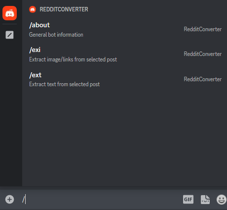
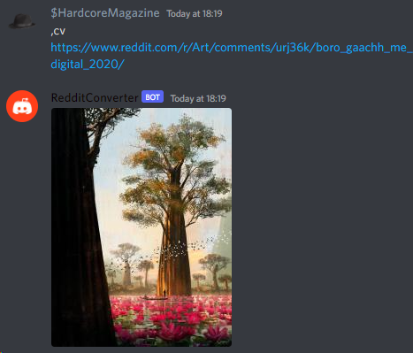

# RedditToDiscordShare (RTDS)

Bot made explicitly to extract 
images/links & text from Reddit links
and post them as embedded files 
-- so your friends/server-mates don't have to open post
in reddit app.

**Tested and works with**:
- Normal & "share" links
- Links with brackets '<', '>' and '||spoiler||' tag
- Posts that contain external links (such as YouTube, Imgur, Wikipedia)
- GIF posts
- NSFW posts

**Doesn't work with**:
- Reddit videos
- Gallery (multi-picture) posts

**Invite bot to your server**:
* [Click](https://discord.com/api/oauth2/authorize?client_id=975771580993003540&permissions=274878024704&scope=bot) [0% uptime, looking for new hosts]

---
### Usage [new]
All commands can be accessed with /  
  
If users cannot access bot commands (none available/show up),
make sure you set 'Integration' settings right! 

---
### Usage [legacy]
```
[prefix]help - list all commands
[prefix]cv [Submission_URL] - extract image/link from selected post  
[prefix]cvt [Submission_URL] - extract text from selected post  
```
Example:  


---
### Dependencies
```
Python 3.8.10
py-cord >= 2.3.2
asyncpraw >= 7.6.1
```
Work on older or newer versions of libraries not guaranteed!

---
### 'cfg.py' contents
```
settings = {
    'discordAPI': {
        'token': 'bot_private_token',
        'prefix': ','
    },
    'redditAPI': {
        'client_id': 'client_id',
        'client_secret': 'secret',
        'password': 'password',  # optional for public submissions
        'user_agent': 'Reddit -> Discord link extraction (by u/HardcoreMagazine)',
        'username': 'username',  # optional for public submissions
    }
}
```
